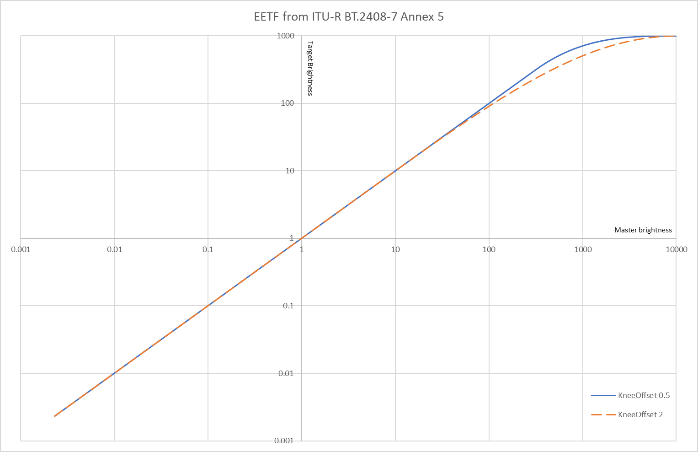
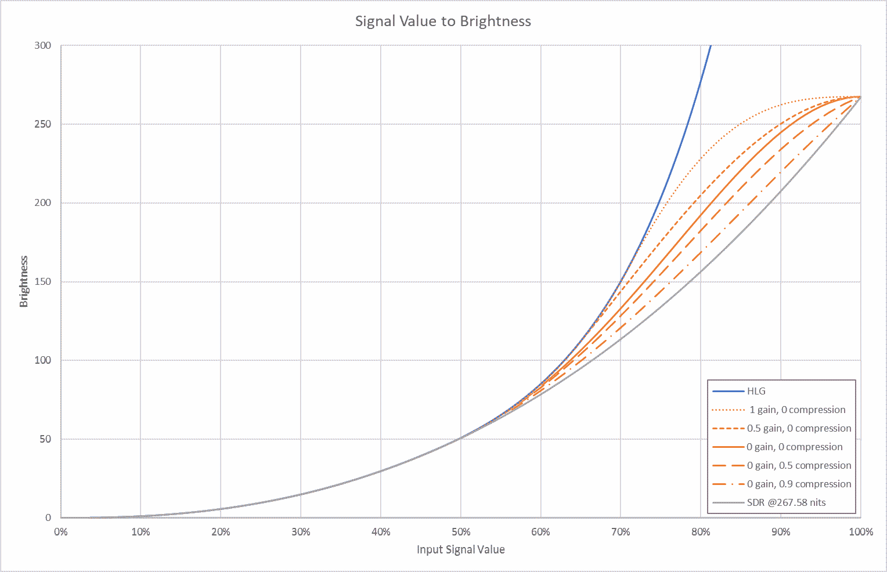

While `DoViBaker` is the name of the main component, the package actually includes a suite of different tools:
- [DoViBaker](#dovibaker): Bake a DolbyVision stream to a PQ stream 
- [DoViTonemap](#dovitonemap): static or dynamic tonemapping of a PQ stream
- [DoViLutGen.exe](#dovilutgenexe): creates LUTs for converting PQ streams to HLG or SDR, or for converting HLG to SDR
- [AVSCube](#avscube): applies a LUT to a stream
- [DoViCubes](#dovicubes): chooses one of multiple LUTs to apply based on the scenes maxCll
- [DoViStatsFileLoader](#dovistatsfileloader): loads the stats-file created by `StatsFileCreator.avs` enabling `DoViTonemap` or `DoViCubes` to apply dynamic processing on non-DolbyVision PQ streams
- [StatsFileCreator.avs](#statsfilecreatoravs): analyzes a non-DolbyVision PQ stream and generates a stats-file which enables dynamic tonemapping
- [DoViAnalyzer.exe](#dovianalyzerexe): analyzes a given RPU.bin file
- [LumaScaleHelper.avs](#lumascalehelperavs): manually compare a PQ stream to a pre-existing SDR stream to extract the lumaScale which can be given to DoViTonemap
- [BetterGrayscale.avsi](#bettergrayscaleavsi): necessary for LumaScaleHelper.avs

For an explanation of all the terminology used and the technical concepts behind, please consult the Red, Orange and Yellow Books of UHD Forms Guidelines: [https://ultrahdforum.org/guidelines/](https://ultrahdforum.org/guidelines/)

# DoViBaker
This avisynth plugin reads the Base Layer, Enhancement Layer and RPU data from a DolbyVision stream to create a clip with all the processing indicated by these substreams baked into a PQ12 output stream.

## General information
This plugin uses the metadata from an RPU file or from the inside stream itself to compose the DolbyVision HDR picture out of the Base Layer (BL) and Enhancement Layer (EL). Display Management (DM) metadata will not be processed per default. It is however possible to further process the clip using DM data by explicitly enabling [Trims](#trims) or by the means of [DoViTonemap](#dovitonemap) or [DoViCubes](#dovicubes). 

## Feeding the plugin 
To my knowledge there are currently three source libraries that can be used. It is advisable to choose one of them in a speed test on your machine.

### [LSMASHSource](https://github.com/HomeOfAviSynthPlusEvolution/L-SMASH-Works)

example.avs:
```
bl=LWLibavVideoSource("clip.ts", format="YUV420P10", stream_index=0)
el=LWLibavVideoSource("clip.ts", format="YUV420P10", stream_index=1)
DoViBaker(bl,el)
```
### [FFmpegSource](https://codeberg.org/StvG/ffms2)

example.avs:
```
bl=FFVideoSource("clip.ts", threads=1, track=0)
el=FFVideoSource("clip.ts", threads=1, track=1)
DoViBaker(bl,el)
```

### [DGDecNV](https://www.rationalqm.us/dgdecnv/binaries/)

1. Get dovi_tool: https://github.com/quietvoid/dovi_tool/releases/tag/2.1.0
2. Extract the Base and Enhancement Layers separately from the initial profile 7 stream
3. Extract the RPU data from the Enhancement Layer using dovi_tool
4. Write a Avisynth script like the example below

example.avs:
```
bl=DGSource("blclip.dgi")
el=DGSource("elclip.dgi")
DoViBaker(bl,el,rpu="RPU.bin")
```

## Output stream
The output stream created by `DoViBaker` is PQ12 in a 16-bit RGB stream. That means it is a 16-bit RGB stream employing Perceptual Quantization as the transfer function, and with 12-bit effective color depth per component on the wide color gamut specified in BT.2100.

## Static Metadata
The metadata typical for HDR10 streams can be added manually to the output stream during the encoding if needed. Using x265 this can be done with the following flags:
 * --master-display "G(13250,34500)B(7500,3000)R(34000,16000)WP(15635,16450)L(40000000,50)"
 * --max-cll "1442,329"

The above values are just an example and the acual values must be taken from the source stream. The values for `L` of the `master-display` flag are given by the frame property `_dovi_static_master_display_max_luminance` multiplied by 10000 and `_dovi_static_master_display_min_luminance` set by `DoViBaker`. Not all DolbyVision substreams carry these values however, in which case you will need to read them from the Base Layer stream, for example using [MediaInfo](https://mediaarea.net/MediaInfo). The values above for `G`, `B`, `R` and `WP` are for the most usually used `Display P3` color gamut. 
The values for the `max-cll` flag are given by the `_dovi_static_max_content_light_level` and `_dovi_static_max_avg_content_light_level` respectively. Again, not all DolbyVision substreams carry those, in which case you will need to rely on the values from your Base Layer.

## Trims
It is possible to apply the trims available in the DolbyVision substream. Select which trim to apply using the `trimPq` argument and set `targetMaxNits` and `targetMinNits` as necessary. Be warned however, only the typical CM v2.9 processing is implemented thus far, and most streams don't have very optimized parameters, producing suboptimal results. Thus this feature is experimental only!

Typical trim targets usually available are:
* 100 nits, with a `trimPq` of 2081
* 600 nits, with a `trimPq` of 2851
* 1000 nits, with a `trimPq` of 3079

In comparison to trims and especially for higher brightness targets like 600 nits and above, results might be better using [DoViTonemap](#dovitonemap) in conjunction with [DoViBaker](#dovibaker).

## Frame Properties
The following frame properties will be set:
- `_Matrix` set to 0, representing that the output is RGB
- `_ColorRange` set to 0 in case of full range and 1 in case of limited range
- `_SceneChangePrev` set to 1 for the first frame in a scene
- `_dovi_dynamic_min_pq` the min_pq value of the current scene
- `_dovi_dynamic_max_pq` the max_pq value of the current scene
- `_dovi_dynamic_max_content_light_level` the equivalend value of maximal nits of the current scene
- `_dovi_static_max_pq` the max_pq value of the whole stream
- `_dovi_static_max_content_light_level` the value of maximal nits of the whole stream
- `_dovi_static_max_avg_content_light_level` the maximum average nits
- `_dovi_static_master_display_max_luminance` the mastering display maximum luminance in nits
- `_dovi_static_master_display_min_luminance` 10000 times the mastering display minimum luminance in nits

You can get the current tonemapping value of max-content-light-level by reading the frame property `_dovi_dynamic_max_content_light_level`:
```
ScriptClip("""
mcll=propGetInt("_dovi_dynamic_max_content_light_level")
subtitle("maxcll = " + string(mcll))
""")
```

# DoViTonemap
This plugin processes the tonemapping of any HDR PQ streams to lower dynamic range targets. The implementation is based on ITU-R BT.2408-7 Annex 5 (was in ITU-R BT.2390 until revision 7), with the addition of an optional luminosity factor which scales the brightness linearily. 

Color space is preserved and not converted to narrower gamut. For conversions to HLG or SDR additional processing is required, see [DoViLutGen.exe](#dovilutgenexe).

The following arguments control the tonemapping function: 
- `masterMaxNits` and `masterMinNits` set the white and black brightness value of the source. The values for the master brightness can be either given explicitly or `masterMaxNits` and `masterMinNits` can both be left unset (or set to `-1`) which will indicate that the actual values are read from the related frame properties `_dovi_dynamic_max_pq` and `_dovi_dynamic_min_pq` which are set by [DoViBaker](#dovibaker) or [DoViStatsFileLoader](#dovistatsfileloader), leading to a dynamic tonemapping. If not given these will default to `-1`.
- `targetMaxNits` and `targetMinNits` set the desired target capabilities. These must be given explicitly.
- `lumScale` changes the total brightness, this can be usefull since many HDR streams are actually too dark, darker then the respective SDR streams would be. If the equivalent SDR stream is available, the proper `lumScale` factor can be found by using the script [LumScaleHelper.avs](#lumscalehelperavs). This setting is especially important when converting to SDR using LUTs generated by [DoViLutGen.exe](#dovilutgenexe). It is possible to read the luminosity factor from the frame property `_dovi_dynamic_luminosity_scale` by setting `lumSacle` to `-1`. When not given explicitly the default of `1.0` is used.
- `kneeOffset` is a parameter of the tonemapping curve, which governs the size of the region where the tonemapping function is flattened (see figure below). The mathematical validity range is [0.5, 2.0]. In report BT.2408 this value is fixed at 0.5, which leads to low highlight details while favoring max brightness. Here the default value used is `0.75` which should be a better compromise overall, especially in case of dynamic tonemapping.
- `normalizeOutput` normalizes the output from the range `[targetMinNits, targetMaxNits]` to the full range. This can be usefull when the output is just an intermediate result which is further processed, since the usage of the full value range decreases rounding errors down the line. Default is `false`.

The following example applies a dynamic tonemapping to a 1000nits target while reading the current max and min brightness values off the frame properties which are set by [DoViBaker](#dovibaker). The luminosity scale is not given thus the default of 1.0 is used.
```
DoViBaker(bl,el)
DoViTonemap(targetMaxNits=1000, targetMinNits=0)
```

If your source is just PQ and doesn't have a DolbyVision substream, there are two options:
- use static tonemapping by explicitly defining `masterMaxNits` and `masterMinNits` to `DoViTonemap`
- analyse the source using [StatsFileCreator.avs](#statsfilecreatoravs) and provide the created stats-file to [DoViStatsFileLoader](#dovistatsfileloader) for a dynamic tonemapping with `DoViTonemap`

Shown below is the functional form of the PQ tonemapping curve with the following fixed parameters: masterMaxNits=10000, targetMaxNits=1000, masterMinNits=0, lumscale=1.


## Frame Properties
The following frame properties will be consumed (if the related arguments `masterMaxNits`, `masterMinNits` and `lumScale` are set to `-1`):
- `_dovi_dynamic_max_pq` the max_pq value of the current scene
- `_dovi_dynamic_min_pq` the min_pq value of the current scene
- `_dovi_dynamic_luminosity_scale` the luminosity scaling factor of the current scene
- `_ColorRange` both limited and full range RGB inputs are supported

The following frame properties will be set:
- `_ColorRange` set to 0, since the output is always full range RGB independently of the input

# DoViLutGen.exe
This application generates LUTs for conversions between BT.2100 PQ, BT.2100 HLG, BT.2020 SDR and BT.709 SDR. The PQ to HLG conversion is based on BT.2408-7 in conjunction with BT.2100-2. The LUTs with PQ as source will only process input values up to 1000 nits and will clip anything above that. If the PQ source has brightness levels above that, use [DoViTonemap](#dovitonemap) to tonemap the PQ stream to 1000 nits. Only down-conversions are supported, meaning BT.2100 PQ can be converted to BT.2100 HLG, BT.2020 SDR or BT.709 SDR, while BT.2100 HLG can be only converted to BT.2020 SDR or BT.709 SDR and BT.2020 SDR can only be converted to BT.709 SDR.

```
usage: DoViLutGen.exe <output_file> -s <lut_size> [-i <input_format>] [-o <output_format>] [-g <sdr_gain>] [-c <sdr_compression>] [-r <chroma_reduction_factor>]
```

The meaning of the arguments:
- `output file` the name of the to-be-generated LUT file
- `lut size` generally a bigger LUT, is a better LUT. A good size is `65` when input is default BT.2100 PQ. In all other cases `50` is enough.
- `input format` this optional argument sets the source format of the LUT:
  - `0` for BT.2100 PQ input (default)
  - `1` for BT.2100 PQ input which was re-normalized to 1000 nits
  - `2` for BT.2100 HLG input
  - `3` for BT.2020 SDR input
- `output format` this optional argument sets the destination format of the LUT:
  - `0` for BT.2100 HLG output (default)
  - `1` for BT.2020 SDR output
  - `2` for BT.709 SDR output with hard clipping of the color gamut
  - `3` for BT.709 SDR output with smart color mapping preventing clipping while maintaining the look as much as possbile
- `sdr gain` this optional argument adjusts the SDR mapping function, by setting the amount of gain of light midtones. Value range is [0.0, 1.0], default is `0.0`.
- `sdr compression` this optional argument adjusts the SDR mapping function, by setting the amount of compression of bright highlights. Value range is [0.0, 1.0], default is `0.0`.
- `chroma reduction factor` this optional argument sets the factor by which the chroma is reduced. Default is `1.0`, meaning chroma is not reduced.

Comment on the special input option for PQ re-normalized to 1000 nits:
In that case, the generated LUT will expect that the input PQ was re-normalized to 1000 nits max brightness, meaning that preceeding the LUT processing [DoViTonemap](#dovitonemap) has to used with the option `normalizeOutput` set to `true`. LUTs for re-normalized inputs can be of smaller size than normal LUTs while still providing better quality. A good size for such a LUT is `50` instead of the `65` needed for the default PQ input.

## SDR Looks
The default settings for `sdr_gain` and `sdr_compression` try to emulate a typical SDR look in what concerns dynamic range. This is usually more toned-down (aka flatter) than a typical HDR. For an even even more toned-down look increase `sdr_compression`, or, inversly and if trying to retain as much HDR feeling as possible, increase `sdr_gain`. If the output seems too colorful, the chroma can be decreased by decreasing `chroma_reduction_factor`. Tweaking of these settings will need to be done for each stream individually, while the defaults should be a good starting point in all instances. 

Shown below is the influence of gain and compression on the functional form of the HLG->SDR tonemapping. This curve is also used for PQ->SDR, since that is implemented as PQ->HLG->SDR. As can be seen, if SDR is viewed with a max brightness of 267.6 nits, the brigtness levels of signal values below 50% match to those of HLG. Above 50% signal level HLG increases faster in brightenss, reaching 1000 nits at 100% signal level.


## Workflow for conversions from DolbyVision PQ to HLG
Generate the LUT by the following command:
```
DoViLutGen.exe pq2hlg.cube -s 65 -i 0 -o 0
```

Create the following avisyth script:
```
DoViBaker(bl,el)
DoViTonemap(targetMaxNits=1000, targetMinNits=0)
AVSCube("pq2hlg.cube")
z_ConvertFormat(pixel_type="YUV420P10",colorspace_op="rgb:std-b67:2020:full=>2020ncl:std-b67:2020:limited",chromaloc_op="center=>top_left")
```
Please be aware that in the example the parameter `lumaScale` was not given to `DoViTonemap`, which means that a brightness factor of `1.0` is used. You might want to have this increased if the source is too dark. And if you have the equivalent SDR source at hand, you can extract the factor using [LumScaleHelper.avs](#lumscalehelperavs).

## Workflow for conversions from non-DolbyVision PQ to BT.709 SDR
Generate the LUT by the following command:
```
DoViLutGen.exe pq2sdr709.cube -s 65 -i 0 -o 3
```
At this stage you can experiment with the SDR looks settings `gain` and `compression`.

Create the following avisyth script:
```
z_ConvertFormat(pixel_type="RGBP16",colorspace_op="2020ncl:st2084:2020:limited=>rgb:st2084:2020:full",chromaloc_op="top_left=>center")
DoViTonemap(targetMaxNits=1000, targetMinNits=0, masterMaxNits=4000, masterMinNits=0)
AVSCube("pq2sdr709.cube")
z_ConvertFormat(pixel_type="YUV420P8",colorspace_op="rgb:709:709:full=>709:709:709:limited",chromaloc_op="center=>left")
```
This example uses fixed values for the `masterMaxNits` and `masterMinNits` settings of `DoViTonemap`, meaning it is a static tonemapping. By virtue of [StatsFileCreator.avs](#statsfilecreatoravs) and [DoViStatsFileLoader](#dovistatsfileloader) it is also possble to have the clip analyzed allowing for dynamic tonemapping (then `masterMaxNits` and `masterMinNits` would be left unset).

Just like in the HLG example above, the parameter `lumaScale` was not given to `DoViTonemap`, which means that a brightness factor of `1.0` is used. This will very rarely be the right choice. In contrast to HLG conversions, this setting is somewhat more relevant here. More often than not it will need to be above `2.0` or even higher. 

## Workflow for conversions from HLG to BT.709 SDR
Generate the LUT by the following command:
```
DoViLutGen.exe hlg2sdr709.cube -s 50 -i 2 -o 3
```
At this stage you can experiment with the SDR looks settings `gain` and `compression`.

Create the following avisyth script:
```
z_ConvertFormat(pixel_type="RGBP16",colorspace_op="2020ncl:std-b67:2020:limited=>rgb:std-b67:2020:full",chromaloc_op="top_left=>center")
AVSCube("hlg2sdr709.cube")
z_ConvertFormat(pixel_type="YUV420P8",colorspace_op="rgb:709:709:full=>709:709:709:limited",chromaloc_op="center=>left")
```

# AVSCube
This is a simplified version of http://avisynth.nl/index.php/AVSCube with almost no adjustability whatsoever. It provides the same quality of image processing as the LUT processing done by [DoViCubes](#dovicubes), while supporting only a single LUT. The desire for this implementation in addition to the already existing [Cube](http://www.avisynth.nl/index.php/AVSCube) stems from the fact that the original version has non-optimal default settings.

# DoViCubes
This plugin provides LUT processing capabilites based on the frame property `_dovi_dynamic_max_content_light_level` set by either [DoViBaker](#dovibaker) or [DoViStatsFileLoader](#dovistatsfileloader). One out of a set of multiple LUTs is applied based on adjustable thresholds. This is done by providing a collection of LUTs and limits of validity measured in nits of max-content-light-level. (The LUT processing implentation is based on: https://github.com/sekrit-twc/timecube). It should not be used in conjunction with DoViTonemap, use AVSCube in that case.
```
DoViBaker(bl,el)
DoViCubes(cubes="lut_1000.cube;lut_2000.cube;lut_4000.cube",mclls="1010;2020",cubes_basepath="C:\")
```
This example will use the file lut_1000.cube for frames where the max-content-light-level is below or equal to 1010 nits, the file lut_2000.cube for above 1010 but below or equal 2020 nits and lut_4000.cube for all frames above 2020 nits. All cube files must be available in the path given to cubes_basepath, in this example it would be "C:\\".

## Frame Properties
The following frame properties will be consumed:
- `_dovi_dynamic_max_content_light_level` the maximal nits value of the current scene

# DoViStatsFileLoader
This plugin reads the stats-file generated by the avisynth script [StatsFileCreator.avs](#statsfilecreatoravs). It can be used for sources which do not have any DolbyVision substream, but where a dynamic processing by [DoViTonemap](#dovitonemap) or [DoViCubes](#dovicubes) is still desired.
The format of each line of the stats-file needs to be, last entry is optional:  
`<frame_number> <decision_if_frame_is_last_in_scene> <frame_max_pq> <frame_min_pq> <frame_lum_scale>`

Additionally it is also possible to provide another scene cut file, created by other means than through [StatsFileCreator.avs](#statsfilecreatoravs). In this case the scene cuts are going to be taken for that file and the stream statistics from the stats-file. The format of each line of the optional alternative scene cut file needs to be:  
`<frame_number_of_first_frame_after_scene_cut>`

In this example the input stats-file is read feeding [DoViTonemap](#dovitonemap):
```
DoViStatsFileReader("statsFile.txt")
DoViTonemap(targetMaxNits=1000, targetMinNits=0)
```

## Frame Properties
The following frame properties will be set:
- `_SceneChangePrev` set to 1 for the first frame in a scene
- `_SceneChangeNext` set to 1 for the last frame in a scene
- `_dovi_dynamic_min_pq` the min_pq value of the current scene
- `_dovi_dynamic_max_pq` the max_pq value of the current scene
- `_dovi_dynamic_max_content_light_level` the equivalend value of maximal nits of the current scene
- `_dovi_dynamic_luminosity_scale` the optional luminosity scaling factor of the current scene
- `_dovi_static_max_pq` the max_pq value of the whole stream
- `_dovi_static_max_content_light_level` the value of maximal nits of the whole stream

# StatsFileCreator.avs
This avisynth script scans through the clip and writes the stats-file needed for [DoViStatsFileLoader](#dovistatsfileloader). The stats-file includes scene cuts and per-frame max brightness values. The scene cut detection algorithm is a rather simple implementation, which is however good enough for most cases.

The format of each line of the stats-file created is:  
`<frame_number> <decision_if_frame_is_last_in_scene> <frame_max_pq> <frame_min_pq>`

The format of each line of the optional alternative scene cut file created is:  
`<frame_number_of_first_frame_after_scene_cut>`

The script can be run on the commandline using [avs2pipemod](http://avisynth.nl/index.php/Avs2pipemod) or [AVSMeter](https://forum.doom9.org/showthread.php?t=174797).
```
./avs2pipemod64.exe -benchmark StatsFileCreator.avs
```
```
./AVSMeter64.exe StatsFileCreator.avs
```

# DoViAnalyzer.exe
This application analyzes the RPU.bin file in order to show information relevant to deciding whether it is worth to use [DoViBaker](#dovibaker) or if this can be skipped completely and the Base Layer can be used directly.

```
usage: DoViAnalyzer.exe <path_to_rpu.bin_file> <optional_scenecutfile.txt>
```
The output will show the following attributes:
1. clip length
2. overall max-content-light-level
3. unusual color matrices defined by the RPU file
4. mapping non-identity introduced by the RPU file
5. enabled processing of the Enhancement Layer
6. available trims, with the trimPq of each trim being shown in brackets
7. optional warning in case that the RGB output is of limited range

Pay attention to 3-5 since these will indicate if the look of the clip will be different when DolbyVision is taken into account compared to just playing the Base Layer clip. If you are using LUTs, pay attention to 7) since in this case the LUTs provided will need to be different.

Additionally it is possible to generate a scenecutfile based on the information from the RPU file. This might be used as the optional scene cut file by [DoViStatsFileLoader](#dovistatsfileloader). Or it might be given to the encoder to improve the scene detection (using the parameter --qpfile for x265). In this case add " K" to the end of each line of the file.

# LumaScaleHelper.avs
Used to find `lumScale` for [DoViTonemap](#dovitonemap) manually. This is the factor by which to mutiply the brightness of the PQ stream such that its base brightness matches that of the SDR stream. Typical factors can be 1.0 all the way to up 5.0 in very extreme cases. Also this factor might fluctuate from scene to scene. In this case it is advisable to use one best fitting factor thoughout the whole stream in order to maintain the creator's intent. For low brightness targets it might however be necessary have the factor adjusted from scene to scene.

Use [AvsPmod](https://forum.doom9.org/showthread.php?t=175823) to manually scan through the file.

# BetterGrayscale.avsi
Needed by [LumScaleHelper.avs](#lumscalehelperavs) for showing a more correct and better comparable grayscale of PQ and SDR sources.

# Remarks concerning compilation
I had some issues linking against Timecube. I was constantly getting the following error:
```
fatal error C1083: Cannot open compiler generated file: 'x64\Release\timecube.asm': No such file or directory
```

It turnes out that this is related to the following setting: "Properties" (of the timecube project) -> "C/C++" -> "Output Files" -> "Assembler Output".
Setting this to "No Listing" resolves the issue.
